# 📊 Diagramas UML - NetDefenders

## Diagrama de Clases Principal

## Diagrama de Secuencia: Nivel 1 - Clasificación de Email

## Diagrama de Secuencia: Nivel 2 - Escanear Archivo

```mermaid
sequenceDiagram
    actor Usuario
    participant L2 as Level2GameManager
    participant RB as ResourceBar
    participant SM as ScoreManager
    participant SymM as SymptomManager
    participant OE as OverlayEducativo
    participant QB as QuizBonusSystem
    
    Usuario->>L2: Seleccionar archivo
    Usuario->>L2: Escanear (-10 recursos)
    L2->>RB: consume(10)
    RB-->>L2: Recursos: 100→90
    L2->>L2: Progreso 3 segundos
    L2->>L2: Evaluar archivo
    
    alt Archivo infectado
        L2->>SM: add_points(20)
        L2-->>Usuario: 🦠 MINER detectado
        
        alt Primera vez este tipo
            L2->>OE: mostrar_quiz_interactivo(quiz_miner)
            OE-->>Usuario: Quiz: ¿Señal de miner?
            Usuario->>OE: Responder opción A
            
            alt Respuesta correcta
                OE->>QB: registrar_respuesta(True)
                OE->>RB: restore(4)
                RB-->>Usuario: +4 recursos (90→94)
                OE-->>Usuario: ✅ Correcto +4 rec
            else Respuesta incorrecta
                OE->>QB: registrar_respuesta(False)
                OE->>RB: consume(2)
                RB-->>Usuario: -2 recursos (90→88)
                OE-->>Usuario: ❌ Incorrecto -2 rec
            end
        end
        
        Usuario->>L2: Limpiar archivo
        L2->>SM: add_points(100)
        L2->>RB: restore(3)
        L2->>SymM: deactivate_symptom("ralentizacion")
        SymM-->>Usuario: FPS 30→60
        L2->>OE: mostrar_refuerzo_sintoma()
        OE-->>Usuario: ✅ Bien hecho +3 rec
        
    else Archivo limpio
        L2-->>Usuario: ✅ Archivo seguro
    end
```

## Diagrama de Componentes

## Diagrama de Estados del Juego

```mermaid
stateDiagram-v2
    [*] --> Inicio
    Inicio --> TestInicial
    TestInicial --> AsignarModoTutor
    AsignarModoTutor --> MenuPrincipal
    
    MenuPrincipal --> SeleccionNivel
    SeleccionNivel --> Nivel1
    SeleccionNivel --> Nivel2
    SeleccionNivel --> TestFinal
    
    state Nivel1 {
        [*] --> CargandoEmails
        CargandoEmails --> MostrandoEmail
        MostrandoEmail --> ClasificandoEmail
        ClasificandoEmail --> MomentEducativo
        MomentEducativo --> Quiz
        Quiz --> ActualizandoScore
        ActualizandoScore --> SiguienteEmail
        SiguienteEmail --> MostrandoEmail: Hay más emails
        SiguienteEmail --> EvaluacionFinal: Todos analizados
        EvaluacionFinal --> Victoria: Score >= 500
        EvaluacionFinal --> Derrota: Score < 500
    }
    
    state Nivel2 {
        [*] --> InicializandoRecursos
        InicializandoRecursos --> GenerandoVirus
        GenerandoVirus --> ActivandoSintomas
        ActivandoSintomas --> NavegandoSistema
        NavegandoSistema --> SeleccionandoArchivo
        SeleccionandoArchivo --> EjecutandoAccion
        EjecutandoAccion --> MostrandoQuiz: Primera vez malware
        MostrandoQuiz --> ActualizandoEstado
        EjecutandoAccion --> ActualizandoEstado: Acción completada
        ActualizandoEstado --> VerificandoCondiciones
        VerificandoCondiciones --> NavegandoSistema: Jugando
        VerificandoCondiciones --> VictoriaN2: Todos eliminados
        VerificandoCondiciones --> DerrotaN2: Recursos agotados
    }
    
    Victoria --> PantallaResultados
    Derrota --> PantallaResultados
    VictoriaN2 --> PantallaResultados
    DerrotaN2 --> PantallaResultados
    PantallaResultados --> MenuPrincipal
    
    TestFinal --> Certificacion: >= 70%
    TestFinal --> TestFinal: < 70% (reintentar)
    Certificacion --> MenuPrincipal
    
    MenuPrincipal --> [*]: Salir
```

## Diagrama de Actividades: Flujo de un Nivel Completo

```mermaid
flowchart TD
    Start([Iniciar Nivel]) --> Init[Inicializar componentes]
    Init --> Load[Cargar datos nivel]
    Load --> Tutorial[Mostrar tutorial]
    Tutorial --> Loop{Bucle principal}
    
    Loop -->|Actualizar| Update[Update dt]
    Update --> CheckInput{Hay input?}
    
    CheckInput -->|Sí| ProcessAction[Procesar acción]
    CheckInput -->|No| CheckPassive
    
    ProcessAction --> Evaluate{Evaluar resultado}
    
    Evaluate -->|Éxito| Success[Score +<br/>Feedback positivo]
    Evaluate -->|Error| Error[Score -<br/>Feedback correctivo]
    
    Success --> ShowQuiz{Activar quiz?}
    Error --> ShowQuiz
    
    ShowQuiz -->|Sí| DisplayQuiz[Mostrar quiz]
    ShowQuiz -->|No| LogData
    
    DisplayQuiz --> WaitAnswer[Esperar respuesta]
    WaitAnswer --> EvalQuiz{Correcta?}
    
    EvalQuiz -->|Sí| BonusPoints[Bonus puntos<br/>+ recursos]
    EvalQuiz -->|No| Penalty[Penalización<br/>+ tip educativo]
    
    BonusPoints --> LogData
    Penalty --> LogData
    
    LogData[Registrar en telemetría] --> CheckPassive
    
    CheckPassive[Efectos pasivos<br/>Síntomas, drenaje] --> CheckConditions{Verificar estado}
    
    CheckConditions -->|Recursos agotados| Defeat[Derrota]
    CheckConditions -->|Objetivos completados| Victory[Victoria]
    CheckConditions -->|Continuar| Loop
    
    Victory --> CalcBonus[Calcular bonus finales]
    CalcBonus --> SaveResults[Guardar resultados]
    
    Defeat --> SaveProgress[Guardar progreso]
    
    SaveResults --> ShowStats[Mostrar estadísticas]
    SaveProgress --> ShowStats
    
    ShowStats --> End([Fin Nivel])
```

---

**Equipo NetDefenders** | [Volver al índice](README.md)
