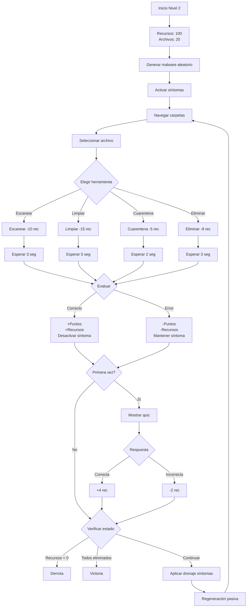

# 🦠 Nivel 2: Cazador de Malware - Mecánicas Detalladas

## Descripción General

El Nivel 2 coloca al jugador en el rol de un administrador de sistemas que debe **detectar, analizar y eliminar diferentes tipos de malware** mientras gestiona recursos limitados. Enfocado en virus, troyanos, ransomware y spyware.

---

## Objetivos de Aprendizaje

### Conceptuales
- Identificar tipos de malware (Virus, Troyano, Ransomware, Spyware, Miner)
- Reconocer síntomas de infección
- Comprender funcionamiento de cada amenaza
- Aprender sobre herramientas de seguridad

### Procedimentales
- Escanear archivos sistemáticamente
- Limpiar malware de forma segura
- Gestionar recursos (CPU, RAM, Ancho de Banda)
- Poner en cuarentena amenazas
- Tomar decisiones bajo presión

### Actitudinales
- Priorizar acciones críticas
- Gestión eficiente de recursos
- Paciencia en procesos largos
- Atención al detalle

---

## Mecánicas del Juego

### 1. **Sistema de Archivos**

**Total de Archivos**: 20 archivos
- **10 archivos infectados** (variados tipos de malware)
- **10 archivos legítimos**
- **Distribución aleatoria en carpetas**

#### Tipos de Malware:
1. **VIRUS** - Multiplica archivos infectados
2. **TROYANO** - Abre puertas traseras
3. **RANSOMWARE** - Cifra archivos
4. **SPYWARE** - Roba información
5. **MINER** - Mina criptomonedas

---

### 2. **Sistema de Recursos**

**Barra de Recursos Unificada**: 0-100 puntos

#### Consumo por Acción:
| Acción | Costo | Duración |
|--------|-------|----------|
| Escanear archivo | -10 | 3 seg |
| Limpiar malware | -15 | 5 seg |
| Cuarentena | -5 | 2 seg |
| Eliminar archivo | -8 | 3 seg |

#### Regeneración:
- **Pasiva**: +2 recursos cada 5 segundos
- **Por acierto**: +3 recursos
- **Por quiz correcto**: +4 recursos
- **Por eliminar malware**: +5 recursos

#### Drenaje por Síntomas:
```python
Síntomas Activos:
├─ Ralentización (Virus): -1 rec/seg
├─ Pérdida RAM (Troyano): -2 rec/seg
├─ Cifrado (Ransomware): -3 rec/seg
├─ Red saturada (Spyware): -1.5 rec/seg
└─ Alto CPU (Miner): -2.5 rec/seg
```

---

### 3. **Herramientas de Seguridad**

#### A. Escanear 🔍
```python
Función: Revelar contenido del archivo
Costo: -10 recursos
Tiempo: 3 segundos
Resultado:
  - Si infectado: Muestra tipo de malware
  - Si limpio: Muestra "ARCHIVO SEGURO"
  
Puntos:
  + Detectar infectado: +100 pts
  + Confirmar limpio: +20 pts
```

#### B. Limpiar 🧹
```python
Función: Eliminar malware del archivo
Costo: -15 recursos
Tiempo: 5 segundos
Resultado:
  - Si infectado: Elimina malware, +3 recursos
  - Si limpio: ERROR -200 pts, -10 recursos extra
  
Puntos:
  + Limpiar correctamente: +300 pts
  - Limpiar archivo limpio: -200 pts
  
Efectos:
  - Desactiva síntoma asociado
  - Aumenta contador de amenazas eliminadas
```

#### C. Cuarentena 📦
```python
Función: Aislar archivo sospechoso
Costo: -5 recursos
Tiempo: 2 segundos
Resultado:
  - Si infectado: Aislado, +2 recursos
  - Si limpio: ERROR -150 pts
  
Puntos:
  + Cuarentena correcta: +250 pts
  - Cuarentena incorrecta: -150 pts
  
Efectos:
  - Desactiva síntoma asociado
  - Archivo no puede infectar otros
```

#### D. Eliminar 🗑️
```python
Función: Borrar archivo permanentemente
Costo: -8 recursos
Tiempo: 3 segundos
Resultado:
  - Si infectado crítico: +400 pts
  - Si infectado: +200 pts
  - Si limpio: ERROR GRAVE -300 pts
  
Puntos:
  + Eliminar ransomware: +400 pts
  + Eliminar otro malware: +200 pts
  - Eliminar archivo limpio: -300 pts (CRÍTICO)
```

---

### 4. **Sistema de Síntomas**

Cada tipo de malware activa efectos visuales y mecánicos únicos:

#### 🐛 Virus - Ralentización
```
Efecto Visual:
  - FPS baja de 60 a 30
  - Animaciones en cámara lenta
  - Cursor con lag
  
Efecto Mecánico:
  - Drenaje: -1 rec/seg
  - Acciones duran +2 segundos
  
Señal Educativa:
  "El sistema va más lento de lo normal"
```

#### 🐴 Troyano - Pérdida de RAM
```
Efecto Visual:
  - Barra de recursos parpadea
  - Mensajes de "Memoria insuficiente"
  - Texturas de baja calidad
  
Efecto Mecánico:
  - Drenaje: -2 rec/seg
  - Costos aumentan +5
  
Señal Educativa:
  "Aplicaciones consumen más RAM de lo normal"
```

#### 🔒 Ransomware - Cifrado de Archivos
```
Efecto Visual:
  - Archivos muestran candado 🔒
  - Pantalla con tinte rojo
  - Contador regresivo falso
  
Efecto Mecánico:
  - Drenaje: -3 rec/seg (CRÍTICO)
  - No se pueden abrir archivos
  
Señal Educativa:
  "Archivos cifrados, pide rescate"
```

#### 👁️ Spyware - Red Saturada
```
Efecto Visual:
  - Icono de red con advertencia
  - Transferencia de datos visible
  - Ventanas emergentes
  
Efecto Mecánico:
  - Drenaje: -1.5 rec/seg
  - Acciones remotas bloqueadas
  
Señal Educativa:
  "Datos enviándose a servidores desconocidos"
```

#### ⛏️ Miner - Alto CPU
```
Efecto Visual:
  - Icono de CPU al 100%
  - Ventilador ruidoso (sonido)
  - Temperatura subiendo
  
Efecto Mecánico:
  - Drenaje: -2.5 rec/seg
  - Todas las acciones cuestan +3
  
Señal Educativa:
  "CPU al máximo sin razón aparente"
```

---

### 5. **Sistema de Quizzes**

Activado la **primera vez que escaneas cada tipo de malware**.

#### Ejemplo: Quiz RANSOMWARE

```
┌───────────────────────────────────────┐
│ 🎯 QUIZ: Ransomware Detectado         │
│ ─────────────────────────────────────│
│ ¿Cuál es la señal más clara de       │
│ ransomware?                          │
│                                      │
│ ⬜ A) Archivos cifrados con .locked  │
│ ⬜ B) CPU al 100%                    │
│ ⬜ C) Ventanas emergentes            │
│                                      │
│ [Responder] [Saltar (-2 rec)]        │
└───────────────────────────────────────┘
```

**Respuesta Correcta (A)**:
```
✅ ¡Excelente! +4 recursos

Explicación:
El ransomware cifra archivos y cambia sus
extensiones (.locked, .crypto, etc.).
Además, muestra un mensaje de rescate.

Tip: NUNCA pagues el rescate. Haz backups
regulares y usa herramientas de descifrado.
```

**Respuesta Incorrecta**:
```
❌ Incorrecto. -2 recursos

La respuesta correcta era: A

Aunque el ransomware puede causar otros
síntomas, el cifrado de archivos es su
característica principal.
```

---

### 6. **Flujo de Juego Típico**



---

### 7. **Condiciones de Victoria**

```python
Victoria:
  - Todos los malware eliminados (10/10)
  - Recursos > 0
  - Score >= 1500 puntos
  
Bonus Final:
  + Por quiz correctos: +50 pts cada uno
  + Por eficiencia (recursos > 50): +500 pts
  + Por velocidad (< 5 minutos): +300 pts
  
  → Desbloquear Test Final
  → Exportar telemetría
  → Video de victoria
```

### 8. **Condiciones de Derrota**

```python
Derrota:
  - Recursos llegan a 0
  - Tiempo límite (10 minutos)
  
  → Mostrar progreso (X/10 eliminados)
  → Análisis de errores
  → Opción de reintentar
```

---

## Tabla de Puntuación Completa

| Acción | Archivo | Puntos | Recursos | Síntoma |
|--------|---------|--------|----------|---------|
| Escanear | Infectado | +100 | -10 | - |
| Escanear | Limpio | +20 | -10 | - |
| Limpiar | Infectado | +300 | -15, +3 | Desactivado |
| Limpiar | Limpio | -200 | -15, -10 | - |
| Cuarentena | Infectado | +250 | -5, +2 | Desactivado |
| Cuarentena | Limpio | -150 | -5 | - |
| Eliminar | Ransomware | +400 | -8 | Desactivado |
| Eliminar | Otro malware | +200 | -8 | Desactivado |
| Eliminar | Limpio | -300 | -8 | - |
| Quiz | Correcto | - | +4 | - |
| Quiz | Incorrecto | - | -2 | - |

---

## Telemetría Registrada

```python
Por cada acción se registra:
{
  "level": 2,
  "timestamp": "2025-12-03 11:42:18",
  "archivo_id": 7,
  "tipo_archivo": "infectado",
  "malware_tipo": "ransomware",
  "herramienta_usada": "limpiar",
  "es_correcto": True,
  "puntos_ganados": 300,
  "recursos_antes": 65,
  "recursos_despues": 53,
  "sintoma_activo": "cifrado",
  "sintoma_desactivado": True,
  "quiz_mostrado": True,
  "quiz_correcto": True,
  "tiempo_accion_segundos": 5
}
```

---

## Tips de Estrategia

### 🎯 Estrategia Óptima
1. **Escanear todo primero** - Identifica amenazas (-200 recursos)
2. **Priorizar Ransomware** - Mayor drenaje (-3 rec/seg)
3. **Limpiar en orden** - De mayor a menor amenaza
4. **Responder quizzes** - +4 recursos cada uno
5. **Monitorear recursos** - No dejar que bajen de 20

### ⚠️ Errores Comunes
- Limpiar sin escanear (riesgo de error)
- Ignorar síntomas activos (drenaje acumulado)
- No responder quizzes (perder bonus de recursos)
- Eliminar archivos limpios (penalización grave)

---

## Próximas Mejoras

- [ ] Más tipos de malware (adware, rootkit)
- [ ] Sistema de combos entre herramientas
- [ ] Modo cooperativo (2 jugadores)
- [ ] Desafíos diarios

---

**Equipo NetDefenders** | [Volver al índice](README.md)
